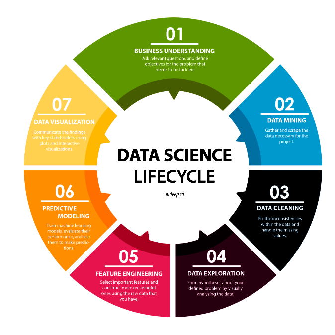

## My Worked Projects

One of the most common confusions arises among the modern technologies such as artificial intelligence, machine learning, big data, data science, deep learning and more. While they are all closely interconnected, each has a distinct purpose and functionality. Over the past few years, the popularity of these technologies has risen to such an extent that several companies have now woken up to their importance on massive levels and are increasingly looking to implement them for their business growth.

However, among aspirants, there seem to be clouds of misconceptions surrounding these various technologies.



## Projects

### House Price -Linear Regression
A house value is simply more than location and square footage. Like the features that make up a person, an educated party would want to know all aspects that give a house its value.

We are going to take advantage of all of the feature variables available to use and use it to analyze and predict house prices.


``` 
#property excersise
import numpy as np
import pandas as pd

# import visuvalization
import matplotlib.pyplot as plt
import seaborn as sb
%matplotlib inline

#import linear
from sklearn.linear_model import LinearRegression

#import train test
from sklearn.model_selection import train_test_split

#import metrics
from sklearn.metrics import r2_score, accuracy_score
from sklearn import metrics
from scipy import stats

pro= pd.read_csv("houseprice.csv")
pro.shape

(21597, 21)

pro.head()


```
[Click here for more](https://github.com/Meghashyamt/House-price)

### Import Kaggle Data
Struggling to work on large datasets in Kaggle to notebooks, here the required code you can work on easily
 
```
Easy Steps to persist Kaggle profile

Download kaggle.json from Kaggle -- MyAccount -- Create New API Token - auto downloads as "kaggle.json

Import json into notebook - run in a cell from google.colab import files files.upload()

Browse to downloaded kaggle.json and upload Setup Kaggle DIR; copy json file ; chmod !mkdir -p ~/.kaggle !cp kaggle.json ~/.kaggle/ !chmod 600 ~/.kaggle/kaggle.json !ls ~/.kaggle

Verify json content !ls -l ~/.kaggle !cat ~/.kaggle/kaggle.json

Install kaggle packages !pip install -q kaggle !pip install -q kaggle-cli

List Kaggle DataSets !kaggle datasets list


```
[Click here for more](https://github.com/Meghashyamt/ImportKaggleData)

### Movie Review -Sentimental Analysis
How about you find out the personal opinion of a person? We can use Sentimental Analysis -textblob

```
Data Description:

The core dataset contains 50,000 reviews split evenly into 25k train and 25k test sets. The overall distribution of labels is balanced (25k pos and 25k neg). In the labeled train/test sets, a negative review has a score <= 4 out of 10, and a positive review has a score >= 7 out of 10. Thus reviews with more neutral ratings are not included in the train/test sets.
```
[Click here for more](https://github.com/Meghashyamt/Movie-Review-Sentiment-Analysisa)

### Parameter Tuning
For every Algorithm we would be struggling to tune your data to meet the 100% accuracy.
We can tune it the best using parameter changes
```
Parameter Tuning for Better Accuracy for All Algorithms in Machine Learning Machine learning involves predicting and classifying data and to do so, you employ various machine learning models according to the dataset. Machine learning models are parameterized so that their behavior can be tuned for a given problem. These models can have many parameters and finding the best combination of parameters can be treated as a search problem. But this very term called parameter may appear unfamiliar to you if you are new to applied machine learning. But don’t worry! You will get to know about it in the very first place of this blog, and you will also discover what the difference between a parameter and a hyperparameter of a machine learning model is.

from sklearn.model_selection import GridSearchCV
penalty = ['l1', 'l2']
C = np.logspace(0, 4, 10)
hyperparameters = dict(C=C, penalty=penalty)
h_logmodel = GridSearchCV(model_lr, hyperparameters, cv=5, verbose=0)
best_logmodel=h_logmodel.fit(X,y)
print('Best Penalty:', best_log

```
[Click here for more](https://github.com/Meghashyamt/Parameter-Tuning-ML)


### Time Series
How you can opt the data everydate and time using Time Series Algorithm

```
import numpy as np
import pandas as pd
from pandas import datetime
import matplotlib.pyplot as plt
%matplotlib inline

def parser(x):
  return datetime.strptime(x,'%Y-%m')

data= pd.read_csv("sales.csv", index_col=0, parse_dates=[0], date_parser=parser)

```

[Click here for more](https://github.com/Meghashyamt/python/blob/master/TimeSeries.ipynb)
